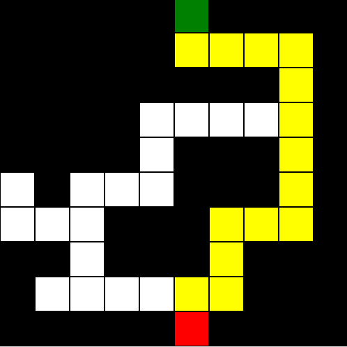

# Maze Solver

Visual maze solver using Tkinter. Shortest path to exit is shown. Input is given via a text file.
Algorithm used: Breadth first search (BFS).

## How it works
Breadth first search (BFS) is used.
It visits multiple paths at the same time. 
The path that reaches the exit first is the shortest path.
For visual representation, the TKinter library is used.

## How to use
Configure your own maze:
- w = wall
- s = start (exactly one required)
- x = exit (exactly one required)
- p = passage
- Multiple exits is not supported yet

Then, run it!

